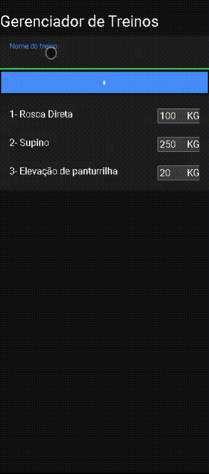

<h1 align="center">
   Gerenciador de Treinos
</h1>

<br>

## 💻 Projeto

O projeto foi desenvolvido como atividade avaliatoria para a materia de PAM-II na Etec Dr Demetrio Azevedo JR com objetivo de desenvolver uma lista onde o usuario possa inserir o nome de seu treino e o pesso necessario para realiza-lo, deixando td salvo no aplicativo mesmo depois de fechado.

## :camera: Demonstração

<div align="center" >
  
</div>

## ⚙ Configuração

1- Pré requisitos
> Node Js 
> Git Bash
> Visual Studio Code

2- Para iniciar a aplicação:
> Baixar o arquivo do projeto
> Extrair o arquivo
> Abrir a pasta com Git Bash

3- Instalar dependencias 
> npm i

4- Iniciar Aplicaçao 
```
> code .
> ionic serve -o
```


## :rocket: Tecnologias

Esse projeto foi desenvolvido com as seguintes tecnologias:

✔️Typescript

✔️SCSS

✔️JavaScript

✔️HTML

---
